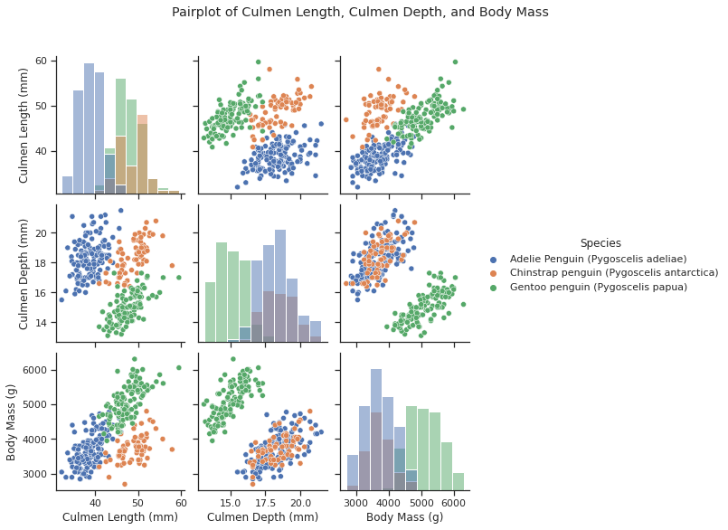
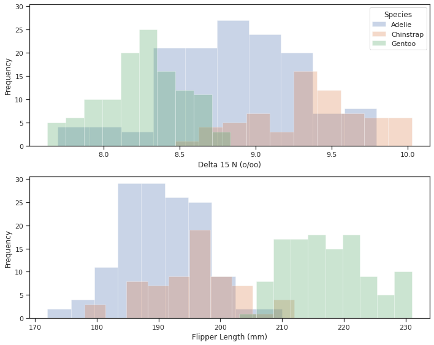
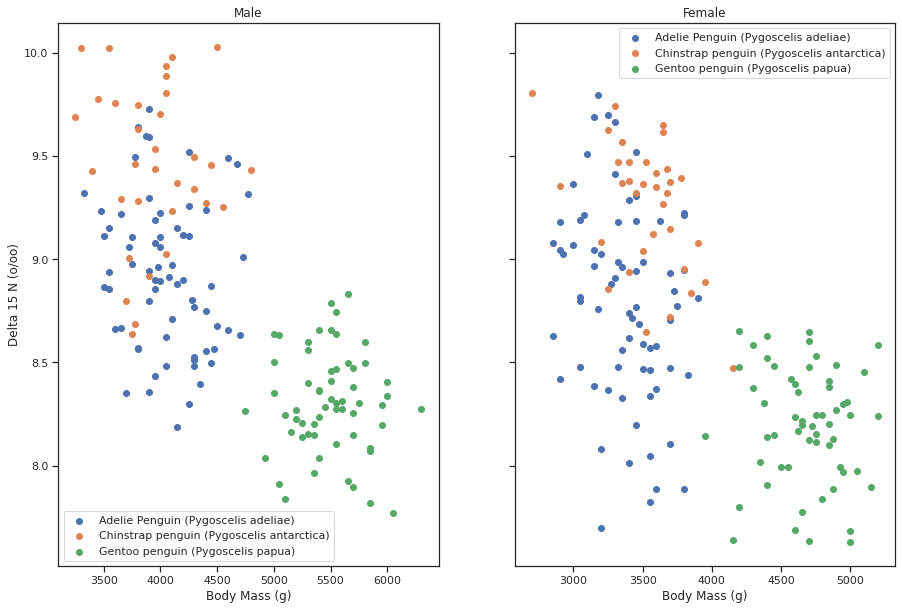
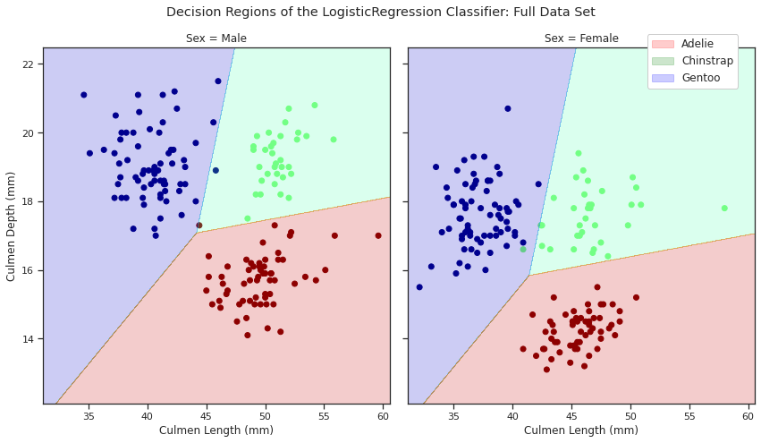
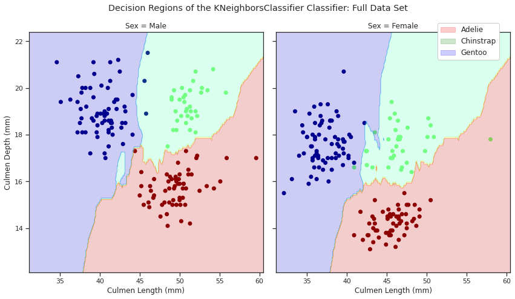
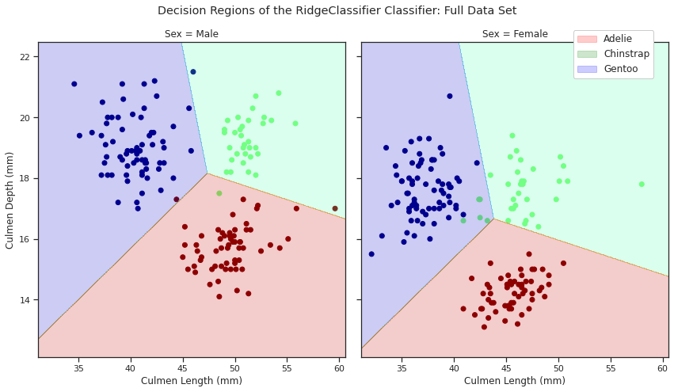

### Animal Species


```python
import warnings
import pandas as pd
import seaborn as sns
from matplotlib import pyplot as plt
from matplotlib import patches as mpatches
import numpy as np
from numpy import arange
from sklearn.linear_model import LinearRegression
from sklearn.linear_model import LogisticRegression
from sklearn.model_selection import cross_val_score
from sklearn.metrics import accuracy_score, confusion_matrix
from sklearn.neighbors import KNeighborsClassifier
from sklearn.model_selection import GridSearchCV
from sklearn.linear_model import RidgeClassifier
from sklearn.model_selection import RepeatedKFold
import seaborn as sns
import statistics as st
```


```python
url = "https://philchodrow.github.io/PIC16A/datasets/palmer_penguins.csv"
penguins = pd.read_csv(url)
```

#### Creating train (X) and test (Y) data from dataset:


```python
# Sets predictor data (X) to include all variables except Species and target data (y) to only Species (our target variable)
X = penguins.drop(labels = "Species", axis = 1)
y = penguins[["Species"]]
```


```python
from sklearn.model_selection import train_test_split
X_train, X_test, y_train, y_test = train_test_split(X, y, test_size = 0.2, random_state = 1234)
```


```python
# Checks that data sets were created correctly
X.shape, y.shape, X_train.shape, X_test.shape, y_train.shape, y_test.shape
```


    ((344, 16), (344, 1), (275, 16), (69, 16), (275, 1), (69, 1))


#### Cleaning and checking cleanup for X_train and X_test:


```python
def X_cleanup(X):
  """
  X_cleanup: A function that takes in a dataframe X and cleans it so it is ready for analysis
  Paramaters: 
    X: The dataframe to be cleaned
  Returns:
    X: The cleaned data frame
  """
  # Drops unnessecary colums from X
  X = X.drop(["Region", "studyName", "Individual ID", "Stage", "Comments", 
            "Clutch Completion", "Date Egg", "Sample Number"], axis = 1)
  
  # Drops NaN and Na values from X
  X = X.dropna()

  # Removes rows in X where "Sex" is coded as "."
  X = X[X["Sex"] != "."]

  # Recodes Sex values of MALE and FEMALE to 1 and 2 respectively
  X["Sex"] = X["Sex"].map({"MALE": 1, "FEMALE": 2})

  # Recodes Island values of Torgersen, Dream, and Biscoe to 1, 2 and 3 respectively
  X["Island"] = X["Island"].map({"Torgersen": 1, "Dream": 2, "Biscoe": 3})
  
  return X
```


```python
# Cleaning X_train, X_test and X
X_train = X_cleanup(X_train)
X_test = X_cleanup(X_test)
X = X_cleanup(X)
```


```python
# Checking that X_train, X_test, and X were cleaned correctly
X_train, X_test, X
```


    (     Island  Culmen Length (mm)  Culmen Depth (mm)  Flipper Length (mm)  \
     323       3                49.1               15.0                228.0   
     149       2                37.8               18.1                193.0   
     288       3                43.5               14.2                220.0   
     146       2                39.2               18.6                190.0   
     227       3                46.7               15.3                219.0   
     ..      ...                 ...                ...                  ...   
     204       2                45.7               17.3                193.0   
     53        3                42.0               19.5                200.0   
     294       3                46.4               15.0                216.0   
     211       2                45.6               19.4                194.0   
     303       3                50.0               15.9                224.0   
     
          Body Mass (g)  Sex  Delta 15 N (o/oo)  Delta 13 C (o/oo)  
     323         5500.0    1            8.65914          -25.79203  
     149         3750.0    1            8.97533          -26.03495  
     288         4700.0    2            8.64931          -26.68867  
     146         4250.0    1            9.11006          -25.79549  
     227         5200.0    1            8.22673          -25.42760  
     ..             ...  ...                ...                ...  
     204         3600.0    2            9.41500          -24.80500  
     53          4050.0    1            8.48095          -26.31460  
     294         4700.0    2            8.47938          -26.95470  
     211         3525.0    2            9.46985          -24.65786  
     303         5350.0    1            8.20042          -26.39677  
     
     [258 rows x 8 columns],
          Island  Culmen Length (mm)  Culmen Depth (mm)  Flipper Length (mm)  \
     64        3                36.4               17.1                184.0   
     237       3                49.2               15.2                221.0   
     115       3                42.7               18.3                196.0   
     97        2                40.3               18.5                196.0   
     37        2                42.2               18.5                180.0   
     ..      ...                 ...                ...                  ...   
     224       3                47.6               14.5                215.0   
     167       2                50.5               19.6                201.0   
     296       3                47.5               14.2                209.0   
     40        2                36.5               18.0                182.0   
     304       3                44.9               13.8                212.0   
     
          Body Mass (g)  Sex  Delta 15 N (o/oo)  Delta 13 C (o/oo)  
     64          2850.0    2            8.62623          -26.11650  
     237         6300.0    1            8.27376          -25.00169  
     115         4075.0    1            8.91434          -26.42018  
     97          4350.0    1            8.39459          -26.01152  
     37          3550.0    2            8.04787          -25.49523  
     ..             ...  ...                ...                ...  
     224         5400.0    1            8.23450          -25.54456  
     167         4050.0    1            9.80590          -24.72940  
     296         4600.0    2            8.39299          -26.78733  
     40          3150.0    2            9.68933          -24.42280  
     304         4750.0    2            8.11238          -26.20372  
     
     [66 rows x 8 columns],
          Island  Culmen Length (mm)  Culmen Depth (mm)  Flipper Length (mm)  \
     1         1                39.5               17.4                186.0   
     2         1                40.3               18.0                195.0   
     4         1                36.7               19.3                193.0   
     5         1                39.3               20.6                190.0   
     6         1                38.9               17.8                181.0   
     ..      ...                 ...                ...                  ...   
     338       3                47.2               13.7                214.0   
     340       3                46.8               14.3                215.0   
     341       3                50.4               15.7                222.0   
     342       3                45.2               14.8                212.0   
     343       3                49.9               16.1                213.0   
     
          Body Mass (g)  Sex  Delta 15 N (o/oo)  Delta 13 C (o/oo)  
     1           3800.0    2            8.94956          -24.69454  
     2           3250.0    2            8.36821          -25.33302  
     4           3450.0    2            8.76651          -25.32426  
     5           3650.0    1            8.66496          -25.29805  
     6           3625.0    2            9.18718          -25.21799  
     ..             ...  ...                ...                ...  
     338         4925.0    2            7.99184          -26.20538  
     340         4850.0    2            8.41151          -26.13832  
     341         5750.0    1            8.30166          -26.04117  
     342         5200.0    2            8.24246          -26.11969  
     343         5400.0    1            8.36390          -26.15531  
     
     [324 rows x 8 columns])


#### Cleaning and checking cleanup for y_train and y_test:


```python
def y_cleanup(y, X):
  """
  y_cleanup: A function that takes in a data frame y and a data frame X and cleans y so it is ready for analysis
  Paramaters:
    y: The data frame to be cleaned
    X: Another data frame that is used to ensure the same indicies are used for y and X
  Returns:
    y: The cleaned data frame
  """
  # Ensures that indicies of y are the same as the indicies of X
  y = y.loc[X.index.to_numpy()]

  # Recodes the values of species from Adelie, Chinstrap, and Gentoo to 1, 2, and 3 respectively
  y["Species"] = y["Species"].map({"Adelie Penguin (Pygoscelis adeliae)": 1,
                                 "Chinstrap penguin (Pygoscelis antarctica)": 2,
                                 "Gentoo penguin (Pygoscelis papua)": 3})
  return y
```


```python
# Cleaning y_train, y_test, and y
y_train = y_cleanup(y_train, X_train)
y_test = y_cleanup(y_test, X_test)
y = y_cleanup(y, X)
```


```python
# Checks that y_train, y_test, and y were cleaned properly
y_train, y_test, y
```


    (     Species
     323        3
     149        1
     288        3
     146        1
     227        3
     ..       ...
     204        2
     53         1
     294        3
     211        2
     303        3
     
     [258 rows x 1 columns],      Species
     64         1
     237        3
     115        1
     97         1
     37         1
     ..       ...
     224        3
     167        2
     296        3
     40         1
     304        3
     
     [66 rows x 1 columns],      Species
     1          1
     2          1
     4          1
     5          1
     6          1
     ..       ...
     338        3
     340        3
     341        3
     342        3
     343        3
     
     [324 rows x 1 columns])


#### Observing the relationships of variables


```python
# Creates a temporary data frame for visual analysis. Executes the same functions as X_cleanup but doesn't recode Island variable so X_cleanup was not used
temp_df = penguins
temp_df = temp_df.drop(["Region", "studyName", "Individual ID", "Stage", "Comments", 
            "Clutch Completion", "Date Egg", "Sample Number"], axis = 1)
temp_df = temp_df.dropna()
temp_df = temp_df[temp_df["Sex"] != "."]
temp_df["Sex"] = temp_df["Sex"].map({"MALE": 1, "FEMALE": 2})

# Creates a table comparing the mean culmen length, flipper length, body mass, and Delta 15 N for each species, island, and sex
temp_df.groupby(["Species", "Island", "Sex"])["Culmen Length (mm)", "Flipper Length (mm)", "Body Mass (g)", "Delta 15 N (o/oo)"].mean()
```


  <div id="df-67627792-065f-46bc-94ca-b5c94df64a12">
    <div class="colab-df-container">
      <div>
<style scoped>
    .dataframe tbody tr th:only-of-type {
        vertical-align: middle;
    }

    .dataframe tbody tr th {
        vertical-align: top;
    }

    .dataframe thead th {
        text-align: right;
    }
</style>
<table border="1" class="dataframe">
  <thead>
    <tr style="text-align: right;">
      <th></th>
      <th></th>
      <th></th>
      <th>Culmen Length (mm)</th>
      <th>Flipper Length (mm)</th>
      <th>Body Mass (g)</th>
      <th>Delta 15 N (o/oo)</th>
    </tr>
    <tr>
      <th>Species</th>
      <th>Island</th>
      <th>Sex</th>
      <th></th>
      <th></th>
      <th></th>
      <th></th>
    </tr>
  </thead>
  <tbody>
    <tr>
      <th rowspan="6" valign="top">Adelie Penguin (Pygoscelis adeliae)</th>
      <th rowspan="2" valign="top">Biscoe</th>
      <th>1</th>
      <td>40.590909</td>
      <td>190.409091</td>
      <td>4050.000000</td>
      <td>8.872945</td>
    </tr>
    <tr>
      <th>2</th>
      <td>37.359091</td>
      <td>187.181818</td>
      <td>3369.318182</td>
      <td>8.774242</td>
    </tr>
    <tr>
      <th rowspan="2" valign="top">Dream</th>
      <th>1</th>
      <td>40.012000</td>
      <td>192.520000</td>
      <td>4052.000000</td>
      <td>8.984427</td>
    </tr>
    <tr>
      <th>2</th>
      <td>36.911111</td>
      <td>187.851852</td>
      <td>3344.444444</td>
      <td>8.914803</td>
    </tr>
    <tr>
      <th rowspan="2" valign="top">Torgersen</th>
      <th>1</th>
      <td>40.752381</td>
      <td>195.761905</td>
      <td>4059.523810</td>
      <td>8.919919</td>
    </tr>
    <tr>
      <th>2</th>
      <td>37.436364</td>
      <td>188.727273</td>
      <td>3390.909091</td>
      <td>8.663160</td>
    </tr>
    <tr>
      <th rowspan="2" valign="top">Chinstrap penguin (Pygoscelis antarctica)</th>
      <th rowspan="2" valign="top">Dream</th>
      <th>1</th>
      <td>51.069697</td>
      <td>199.727273</td>
      <td>3938.636364</td>
      <td>9.464535</td>
    </tr>
    <tr>
      <th>2</th>
      <td>46.573529</td>
      <td>191.735294</td>
      <td>3527.205882</td>
      <td>9.250962</td>
    </tr>
    <tr>
      <th rowspan="2" valign="top">Gentoo penguin (Pygoscelis papua)</th>
      <th rowspan="2" valign="top">Biscoe</th>
      <th>1</th>
      <td>49.510000</td>
      <td>221.533333</td>
      <td>5488.750000</td>
      <td>8.303429</td>
    </tr>
    <tr>
      <th>2</th>
      <td>45.563793</td>
      <td>212.706897</td>
      <td>4679.741379</td>
      <td>8.193405</td>
    </tr>
  </tbody>
</table>
</div>
      <button class="colab-df-convert" onclick="convertToInteractive('df-67627792-065f-46bc-94ca-b5c94df64a12')"
              title="Convert this dataframe to an interactive table."
              style="display:none;">

  <svg xmlns="http://www.w3.org/2000/svg" height="24px"viewBox="0 0 24 24"
       width="24px">
    <path d="M0 0h24v24H0V0z" fill="none"/>
    <path d="M18.56 5.44l.94 2.06.94-2.06 2.06-.94-2.06-.94-.94-2.06-.94 2.06-2.06.94zm-11 1L8.5 8.5l.94-2.06 2.06-.94-2.06-.94L8.5 2.5l-.94 2.06-2.06.94zm10 10l.94 2.06.94-2.06 2.06-.94-2.06-.94-.94-2.06-.94 2.06-2.06.94z"/><path d="M17.41 7.96l-1.37-1.37c-.4-.4-.92-.59-1.43-.59-.52 0-1.04.2-1.43.59L10.3 9.45l-7.72 7.72c-.78.78-.78 2.05 0 2.83L4 21.41c.39.39.9.59 1.41.59.51 0 1.02-.2 1.41-.59l7.78-7.78 2.81-2.81c.8-.78.8-2.07 0-2.86zM5.41 20L4 18.59l7.72-7.72 1.47 1.35L5.41 20z"/>
  </svg>
      </button>

  <style>
    .colab-df-container {
      display:flex;
      flex-wrap:wrap;
      gap: 12px;
    }

    .colab-df-convert {
      background-color: #E8F0FE;
      border: none;
      border-radius: 50%;
      cursor: pointer;
      display: none;
      fill: #1967D2;
      height: 32px;
      padding: 0 0 0 0;
      width: 32px;
    }

    .colab-df-convert:hover {
      background-color: #E2EBFA;
      box-shadow: 0px 1px 2px rgba(60, 64, 67, 0.3), 0px 1px 3px 1px rgba(60, 64, 67, 0.15);
      fill: #174EA6;
    }

    [theme=dark] .colab-df-convert {
      background-color: #3B4455;
      fill: #D2E3FC;
    }

    [theme=dark] .colab-df-convert:hover {
      background-color: #434B5C;
      box-shadow: 0px 1px 3px 1px rgba(0, 0, 0, 0.15);
      filter: drop-shadow(0px 1px 2px rgba(0, 0, 0, 0.3));
      fill: #FFFFFF;
    }
  </style>

      <script>
        const buttonEl =
          document.querySelector('#df-67627792-065f-46bc-94ca-b5c94df64a12 button.colab-df-convert');
        buttonEl.style.display =
          google.colab.kernel.accessAllowed ? 'block' : 'none';

        async function convertToInteractive(key) {
          const element = document.querySelector('#df-67627792-065f-46bc-94ca-b5c94df64a12');
          const dataTable =
            await google.colab.kernel.invokeFunction('convertToInteractive',
                                                     [key], {});
          if (!dataTable) return;

          const docLinkHtml = 'Like what you see? Visit the ' +
            '<a target="_blank" href=https://colab.research.google.com/notebooks/data_table.ipynb>data table notebook</a>'
            + ' to learn more about interactive tables.';
          element.innerHTML = '';
          dataTable['output_type'] = 'display_data';
          await google.colab.output.renderOutput(dataTable, element);
          const docLink = document.createElement('div');
          docLink.innerHTML = docLinkHtml;
          element.appendChild(docLink);
        }
      </script>
    </div>
  </div>


```python
sns.set_theme(style="ticks")
sns.pairplot(temp_df[["Culmen Length (mm)", "Culmen Depth (mm)", "Body Mass (g)","Species"]], 
             hue = "Species", diag_kind = 'hist', ).fig.suptitle("Pairplot of Culmen Length, Culmen Depth, and Body Mass", y = 1.08)
```


    Text(0.5, 1.08, 'Pairplot of Culmen Length, Culmen Depth, and Body Mass')


    

    


```python
fig, ax = plt.subplots(2, figsize = (10,8), sharey = True)
#creating a function that we can call to take in the various types of data we need
def hist(df, column, alpha, index):
  ax[index].hist(df[column], alpha = alpha)
  ax[index].set(ylabel = "Frequency",
         xlabel = column
         )
temp_df.groupby("Species", as_index = False).apply(hist, "Delta 15 N (o/oo)", 0.3, 0)
temp_df.groupby("Species", as_index = False).apply(hist, "Flipper Length (mm)", 0.3, 1)
ax[0].legend(labels = ["Adelie", "Chinstrap", "Gentoo"], title = "Species")
plt.tight_layout()
```


    

    


```python
#scatter plot
fig, ax = plt.subplots(1, 2, figsize = (15,10), sharey = True)

#a list of unique species
unique = list(set(temp_df['Species']))

#labeling x and y values and titles of scatterplot
ax[0].set(xlabel = "Body Mass (g)",
          ylabel = "Delta 15 N (o/oo)",
          title = "Male")
ax[1].set(xlabel = "Body Mass (g)",
          title = "Female")

#scatter values of every unique species for each sex
for i in range(len(unique)):
  massM = temp_df['Body Mass (g)'][temp_df['Species'] == unique[i]][temp_df['Sex'] == 1]
  nitroM = temp_df['Delta 15 N (o/oo)'][temp_df['Species'] == unique[i]][temp_df['Sex'] == 1]
  massF = temp_df['Body Mass (g)'][temp_df['Species'] == unique[i]][temp_df['Sex'] == 2]
  nitroF = temp_df['Delta 15 N (o/oo)'][temp_df['Species'] == unique[i]][temp_df['Sex'] == 2]
  
  ax[0].scatter(massM, nitroM)
  ax[0].legend(unique)

  ax[1].scatter(massF, nitroF)
  ax[1].legend(unique)
```


    

    


#### Feature Selection


```python
# Sets potential_features to the different combinations of features found from the above plots
potential_features = [['Sex', 'Culmen Length (mm)', 'Culmen Depth (mm)'], ['Sex', 'Culmen Length (mm)', 'Flipper Length (mm)'], 
                      ['Island', 'Culmen Length (mm)', 'Body Mass (g)'], ['Island', 'Culmen Length (mm)', 'Flipper Length (mm)']]

def cv_score(cols, model):
  """
  cv_score: A function that takes in specified columns and a model and returns the mean of 10 cross-validation scores of the model using the specified cols
  Parameters:
    cols: A list of features in the data set to be scored
    model: The model to be used for cross-validation
  Returns: 
    cv_score prints the columns it is using and returns the mean of 10 cross_validation scores of the model using the specified columns
  """
  print("Using columns: {0}".format(cols))
  return cross_val_score(model, X_train[cols], np.array(y_train["Species"]), cv = 10).mean()


def test_data_score(cols, model):
  """
  test_data_score: A function that takes in specified columns and a model and returns the score of the fitted model against the test set
  Parameters:
    cols: A list of features in the data set to be scored
    model: The model to be used for cross-validation
  Returns:
    test_data_score fits the model using the specified columns and returns the score of the fitted model against the test set
  """
  return model.fit(X_test[cols], np.array(y_test["Species"])).score(X_test[cols], np.array(y_test["Species"]))

for features in potential_features:
  print("CV score: {0}".format(cv_score(features, LogisticRegression(max_iter = 500))))
  print("Test score: {0}".format(test_data_score(features, LogisticRegression(max_iter = 500))))
```

    Using columns: ['Sex', 'Culmen Length (mm)', 'Culmen Depth (mm)']
    CV score: 0.9884615384615385
    Test score: 0.9848484848484849
    Using columns: ['Sex', 'Culmen Length (mm)', 'Flipper Length (mm)']
    CV score: 0.9615384615384617
    Test score: 0.9545454545454546
    Using columns: ['Island', 'Culmen Length (mm)', 'Body Mass (g)']
    CV score: 0.9689230769230772
    Test score: 0.9393939393939394
    Using columns: ['Island', 'Culmen Length (mm)', 'Flipper Length (mm)']
    CV score: 0.9692307692307693
    Test score: 0.9090909090909091


```python
# Sets features to best features found from above functions
features = ['Sex', 'Culmen Length (mm)', 'Culmen Depth (mm)']

# Sets X, X_train, and X_test to only include features columns
X = X[features]
X_train = X_train[features]
X_test = X_test[features]
```

#### Modeling


```python
def fit_and_score(model):
  """
  fit_and_score: A Function that takes in a model with specified paramaters and fits the model to the training data and scores it against the training and testing data
  Paramaters:
    model: A model with specified paramaters that should be fit
  Returns:
    fit_and_score prints the scores of the fitted model against the train data and the test data and returns the fitted model
  """
  print("Score on the training data:", model.fit(X_train, np.array(y_train["Species"])).score(X_train, np.array(y_train["Species"])))
  print("Score on the testing data:", model.fit(X_train, np.array(y_train["Species"])).score(X_test, np.array(y_test["Species"])))
  return model.fit(X_train, np.array(y_train["Species"]))
```


```python
def ConfusionMatrix(model):
  """
  ConfusionMatrix: A function that takes in a fitted model and prints the accuracy score of its predictions as well as a confusion matrix for the fitted model
  Parameters:
    model: A fitted model
  Returns:
    ConfusionMatrix does not return any values and instead prints the accuracy score of the fitted model's predictions and a confusion matrix for the fitted model
  """
  # Evaluates the classifier on the test set
  y_pred = model.predict(X_test)
  print('Accuracy: %.2f' % accuracy_score(y_test, y_pred))
  # Creates a confusion matrix
  cm = pd.DataFrame(confusion_matrix(y_test, y_pred),
                    index = ['Actual ' + i for i in ["Adelie", "Chinstrap", "Gentoo"]],
                    columns = ['Predicted ' + i for i in ["Adelie", "Chinstrap", "Gentoo"]])
  print('Confusion Matrix:')
  display(cm)
```


```python
def DecisionRegion(model, X_set = X, y_set = y, increment = 0.01):
  """
  DecisionRegion: A function that takes in a fitted model and two sets of data and makes a decision region plot based on the model and sets of data
  Parameters: 
    model: A fitted model
    X_set: A data frame of predictor variables. Can be an entire data set, the training set, or the testing set. Default is X (entire set of predictors)
    y_set: A data frame of the target variable. Can be the entire data set, the training set, or the testing set. Defauilt is y (entire set of targets)
    increment: Adjusts number of data points created for meshgrid. Default is 0.01. Adjusting increment can assist with the runtime for different model families
    (Note - X_set and Y_set must have the same number of rows, i.e if X_set = X_train then y_set must = y_train or if X_set = X then y_set must = y)
  Returns:
    DecisionRegion does not return any values and instead plots the decision region of the fitted model for X_set and y_set
  """

  # Checks if X_set and y_set are the same number of rows and raises a TypeError if not
  if X_set.shape[0] != y_set.shape[0]:
    raise TypeError("X_set and Y_set must have the same number of rows!")

  # Creates two dictionaries. One for labeling the Sex of each plot and the other for labeling the suptitle of the entire plot
  sex_dict = {1: "Male", 2: "Female"}
  title_dict = {X.shape: "Full Data Set", X_train.shape: "Training Set", X_test.shape: "Testing Set"}

  # Creates string for the model being used
  model_string = str(model).split("(")[0]

  # Assigns the unique qualitative variable values of X to unique_qual_values
  unique_qual_values = [int(i) for i in np.unique(X["Sex"])]

  # Creates a 2 side by side plots that share a y-axis
  fig, ax = plt.subplots(1, 2, figsize = (12, 7), sharey = True)

  # Creates a meshgrid of the dataset (uses all possible values (incrementing by 0.01) from min to max of each feature in X)
  f1_min, f1_max = X["Culmen Length (mm)"].min() - 1, X["Culmen Length (mm)"].max() + 1
  f2_min, f2_max = X["Culmen Depth (mm)"].min() - 1, X["Culmen Depth (mm)"].max() + 1
  f1, f2 = np.meshgrid(np.arange(f1_min, f1_max, increment), np.arange(f2_min, f2_max, increment))

  # For loop that iterates through each unique value of the qualitative feature of X
  for i in unique_qual_values:

    # Predicts the species of each point in the meshgrid
    Z = model.predict(np.c_[np.ones(f1.ravel().shape) * 1.0 * i, f1.ravel(), f2.ravel()])
    Z = Z.reshape(f1.shape)

    # Plots the test set samples as a scatter plot
    ax[i - 1].scatter(X_set[X_set["Sex"]==i]["Culmen Length (mm)"], 
                       X_set[X_set["Sex"]==i]["Culmen Depth (mm)"], 
                       c=y_set[X_set["Sex"]==i]["Species"], cmap='jet') 
  
    # Plots the decision regions
    ax[i - 1].contourf(f1, f2, Z, alpha=0.2, cmap='jet') 
    
    # Sets the xlabel of the plot to Culmen Length (mm) and the title to the respective qualitiative feature value
    ax[i - 1].set_xlabel('Culmen Length (mm)')
    ax[i - 1].set_title('Sex = ' + sex_dict[i])

  # Makes a legend for each species and their respective color
  legend0 = mpatches.Patch(color = 'red', label = 'Adelie', alpha = 0.2)
  legend1 = mpatches.Patch(color = 'green', label = 'Chinstrap', alpha = 0.2)
  legend2 = mpatches.Patch(color = 'blue', label = 'Gentoo', alpha = 0.2)
  fig.legend(handles = [legend0, legend1, legend2],loc = (0.85,0.8), fontsize = 'medium',framealpha = 1)

  # Sets the ylabel for the entire plot to Culmen Depth (mm) and the title for the entire plot to the type of data set used for X_set and y_set as well as the model and parameters used
  ax[0].set_ylabel('Culmen Depth (mm)')
  plt.suptitle('Decision Regions of the {0} Classifier: {1}'.format(model_string, title_dict[X_set.shape]))
  plt.tight_layout()
  plt.show()
```

#### Logistic Regression Classification


```python
max_score = 0

# For loop that iterates from 0 to 49
for iter in range(50):

  # Ignores any warnings from LogisticRegression() (there were often warnings when the max_iter was small and it would make the output very hard to read)
  warnings.simplefilter("ignore")

  # Sets cv_score to the mean cross-validation score of the LogisticRegression model
  cv_score = cross_val_score(LogisticRegression(max_iter = iter*10), X_train, np.array(y_train["Species"]), cv = 10).mean()

  # Checks if the cv_score is larger than the current max and sets max_score to current cv_score and best_max_iter to iter*10 if yes
  if cv_score > max_score:
    max_score = cv_score
    best_max_iter = iter*10
    
print("The best value for max_iter is {0} with a cross-validation score of {1}".format(best_max_iter, max_score))
```

    The best value for max_iter is 100 with a cross-validation score of 0.9923076923076923


```python
logistic_model = fit_and_score(LogisticRegression(max_iter = best_max_iter))
```

    Score on the training data: 0.9961240310077519
    Score on the testing data: 0.9696969696969697


```python
ConfusionMatrix(logistic_model)
```

    Accuracy: 0.97
    Confusion Matrix:


  <div id="df-10fd0aa3-21ee-4b66-b335-5493175ab3a2">
    <div class="colab-df-container">
      <div>
<style scoped>
    .dataframe tbody tr th:only-of-type {
        vertical-align: middle;
    }

    .dataframe tbody tr th {
        vertical-align: top;
    }

    .dataframe thead th {
        text-align: right;
    }
</style>
<table border="1" class="dataframe">
  <thead>
    <tr style="text-align: right;">
      <th></th>
      <th>Predicted Adelie</th>
      <th>Predicted Chinstrap</th>
      <th>Predicted Gentoo</th>
    </tr>
  </thead>
  <tbody>
    <tr>
      <th>Actual Adelie</th>
      <td>29</td>
      <td>1</td>
      <td>0</td>
    </tr>
    <tr>
      <th>Actual Chinstrap</th>
      <td>1</td>
      <td>15</td>
      <td>0</td>
    </tr>
    <tr>
      <th>Actual Gentoo</th>
      <td>0</td>
      <td>0</td>
      <td>20</td>
    </tr>
  </tbody>
</table>
</div>
      <button class="colab-df-convert" onclick="convertToInteractive('df-10fd0aa3-21ee-4b66-b335-5493175ab3a2')"
              title="Convert this dataframe to an interactive table."
              style="display:none;">

  <svg xmlns="http://www.w3.org/2000/svg" height="24px"viewBox="0 0 24 24"
       width="24px">
    <path d="M0 0h24v24H0V0z" fill="none"/>
    <path d="M18.56 5.44l.94 2.06.94-2.06 2.06-.94-2.06-.94-.94-2.06-.94 2.06-2.06.94zm-11 1L8.5 8.5l.94-2.06 2.06-.94-2.06-.94L8.5 2.5l-.94 2.06-2.06.94zm10 10l.94 2.06.94-2.06 2.06-.94-2.06-.94-.94-2.06-.94 2.06-2.06.94z"/><path d="M17.41 7.96l-1.37-1.37c-.4-.4-.92-.59-1.43-.59-.52 0-1.04.2-1.43.59L10.3 9.45l-7.72 7.72c-.78.78-.78 2.05 0 2.83L4 21.41c.39.39.9.59 1.41.59.51 0 1.02-.2 1.41-.59l7.78-7.78 2.81-2.81c.8-.78.8-2.07 0-2.86zM5.41 20L4 18.59l7.72-7.72 1.47 1.35L5.41 20z"/>
  </svg>
      </button>

  <style>
    .colab-df-container {
      display:flex;
      flex-wrap:wrap;
      gap: 12px;
    }

    .colab-df-convert {
      background-color: #E8F0FE;
      border: none;
      border-radius: 50%;
      cursor: pointer;
      display: none;
      fill: #1967D2;
      height: 32px;
      padding: 0 0 0 0;
      width: 32px;
    }

    .colab-df-convert:hover {
      background-color: #E2EBFA;
      box-shadow: 0px 1px 2px rgba(60, 64, 67, 0.3), 0px 1px 3px 1px rgba(60, 64, 67, 0.15);
      fill: #174EA6;
    }

    [theme=dark] .colab-df-convert {
      background-color: #3B4455;
      fill: #D2E3FC;
    }

    [theme=dark] .colab-df-convert:hover {
      background-color: #434B5C;
      box-shadow: 0px 1px 3px 1px rgba(0, 0, 0, 0.15);
      filter: drop-shadow(0px 1px 2px rgba(0, 0, 0, 0.3));
      fill: #FFFFFF;
    }
  </style>

      <script>
        const buttonEl =
          document.querySelector('#df-10fd0aa3-21ee-4b66-b335-5493175ab3a2 button.colab-df-convert');
        buttonEl.style.display =
          google.colab.kernel.accessAllowed ? 'block' : 'none';

        async function convertToInteractive(key) {
          const element = document.querySelector('#df-10fd0aa3-21ee-4b66-b335-5493175ab3a2');
          const dataTable =
            await google.colab.kernel.invokeFunction('convertToInteractive',
                                                     [key], {});
          if (!dataTable) return;

          const docLinkHtml = 'Like what you see? Visit the ' +
            '<a target="_blank" href=https://colab.research.google.com/notebooks/data_table.ipynb>data table notebook</a>'
            + ' to learn more about interactive tables.';
          element.innerHTML = '';
          dataTable['output_type'] = 'display_data';
          await google.colab.output.renderOutput(dataTable, element);
          const docLink = document.createElement('div');
          docLink.innerHTML = docLinkHtml;
          element.appendChild(docLink);
        }
      </script>
    </div>
  </div>


```python
DecisionRegion(logistic_model, X, y)
```


    

    


#### Nearest Neighbors Classification


```python
#defining a KNN model with that runs the test before using cross validation to find the best hyper parameters
model1 = KNeighborsClassifier(n_neighbors = 50)
model1.fit(X_train, y_train["Species"])
test_score = model1.score(X_test, y_test["Species"])
train_score = model1.score(X_train, y_train["Species"])
print('Testing Score Without CV: {:,.4f}'.format(test_score))
print('Training Score Without CV: {:,.4f}'.format(train_score))
```

    Testing Score Without CV: 0.8939
    Training Score Without CV: 0.9225


```python
warnings.simplefilter("ignore") #ignores warnings of KNieghborsClassifier do to poor parameters as it goes through the GridSearchCv
model2 = KNeighborsClassifier()
#creating a dictionary where that will be set in the GridSearchCV to run through a range of values for the hyper parameters of n_neighbors and leaf_size
param_grid = {'n_neighbors' : np.arange(1,10),
              'leaf_size' : np.arange(1,20)}
#with GridSearchCV, we are able to test multiple parameters within a range of values to find the best accuracy
model2_gscv = GridSearchCV(model2, param_grid, cv = 10)
model2_gscv.fit(X, y)
print('Best Parameters: {0}'.format(model2_gscv.best_params_))

```

    Best Parameters: {'leaf_size': 1, 'n_neighbors': 3}


```python
warnings.simplefilter("ignore") #ignores warnings of KNieghborsClassifier do to poor parameters as it goes through the GridSearchCv 
#recreated a KNN model but instead set the best hyper parameters we got from the above section
model3 = KNeighborsClassifier(n_neighbors = 3, leaf_size = 1)
#creating a dictionary where with different 'weights' parameters so that we can see what the most accurate one is for our code
w_grid = dict()
w_grid['weights'] = ['distance', 'uniform']
model3_gscv = GridSearchCV(model3, w_grid, cv = 10)
model3_gscv.fit(X, y)
print('Best Parameter: {0}'.format(model3_gscv.best_params_))

```

    Best Parameter: {'weights': 'uniform'}


```python
KNN_model = fit_and_score(KNeighborsClassifier(n_neighbors = 3, leaf_size = 1, weights = 'uniform'))
```

    Score on the training data: 0.9922480620155039
    Score on the testing data: 0.9393939393939394


```python
ConfusionMatrix(KNN_model)
```

    Accuracy: 0.94
    Confusion Matrix:


  <div id="df-aa89499f-1a9a-44d4-a7d6-03d04db5c553">
    <div class="colab-df-container">
      <div>
<style scoped>
    .dataframe tbody tr th:only-of-type {
        vertical-align: middle;
    }

    .dataframe tbody tr th {
        vertical-align: top;
    }

    .dataframe thead th {
        text-align: right;
    }
</style>
<table border="1" class="dataframe">
  <thead>
    <tr style="text-align: right;">
      <th></th>
      <th>Predicted Adelie</th>
      <th>Predicted Chinstrap</th>
      <th>Predicted Gentoo</th>
    </tr>
  </thead>
  <tbody>
    <tr>
      <th>Actual Adelie</th>
      <td>28</td>
      <td>2</td>
      <td>0</td>
    </tr>
    <tr>
      <th>Actual Chinstrap</th>
      <td>1</td>
      <td>14</td>
      <td>1</td>
    </tr>
    <tr>
      <th>Actual Gentoo</th>
      <td>0</td>
      <td>0</td>
      <td>20</td>
    </tr>
  </tbody>
</table>
</div>
      <button class="colab-df-convert" onclick="convertToInteractive('df-aa89499f-1a9a-44d4-a7d6-03d04db5c553')"
              title="Convert this dataframe to an interactive table."
              style="display:none;">

  <svg xmlns="http://www.w3.org/2000/svg" height="24px"viewBox="0 0 24 24"
       width="24px">
    <path d="M0 0h24v24H0V0z" fill="none"/>
    <path d="M18.56 5.44l.94 2.06.94-2.06 2.06-.94-2.06-.94-.94-2.06-.94 2.06-2.06.94zm-11 1L8.5 8.5l.94-2.06 2.06-.94-2.06-.94L8.5 2.5l-.94 2.06-2.06.94zm10 10l.94 2.06.94-2.06 2.06-.94-2.06-.94-.94-2.06-.94 2.06-2.06.94z"/><path d="M17.41 7.96l-1.37-1.37c-.4-.4-.92-.59-1.43-.59-.52 0-1.04.2-1.43.59L10.3 9.45l-7.72 7.72c-.78.78-.78 2.05 0 2.83L4 21.41c.39.39.9.59 1.41.59.51 0 1.02-.2 1.41-.59l7.78-7.78 2.81-2.81c.8-.78.8-2.07 0-2.86zM5.41 20L4 18.59l7.72-7.72 1.47 1.35L5.41 20z"/>
  </svg>
      </button>

  <style>
    .colab-df-container {
      display:flex;
      flex-wrap:wrap;
      gap: 12px;
    }

    .colab-df-convert {
      background-color: #E8F0FE;
      border: none;
      border-radius: 50%;
      cursor: pointer;
      display: none;
      fill: #1967D2;
      height: 32px;
      padding: 0 0 0 0;
      width: 32px;
    }

    .colab-df-convert:hover {
      background-color: #E2EBFA;
      box-shadow: 0px 1px 2px rgba(60, 64, 67, 0.3), 0px 1px 3px 1px rgba(60, 64, 67, 0.15);
      fill: #174EA6;
    }

    [theme=dark] .colab-df-convert {
      background-color: #3B4455;
      fill: #D2E3FC;
    }

    [theme=dark] .colab-df-convert:hover {
      background-color: #434B5C;
      box-shadow: 0px 1px 3px 1px rgba(0, 0, 0, 0.15);
      filter: drop-shadow(0px 1px 2px rgba(0, 0, 0, 0.3));
      fill: #FFFFFF;
    }
  </style>

      <script>
        const buttonEl =
          document.querySelector('#df-aa89499f-1a9a-44d4-a7d6-03d04db5c553 button.colab-df-convert');
        buttonEl.style.display =
          google.colab.kernel.accessAllowed ? 'block' : 'none';

        async function convertToInteractive(key) {
          const element = document.querySelector('#df-aa89499f-1a9a-44d4-a7d6-03d04db5c553');
          const dataTable =
            await google.colab.kernel.invokeFunction('convertToInteractive',
                                                     [key], {});
          if (!dataTable) return;

          const docLinkHtml = 'Like what you see? Visit the ' +
            '<a target="_blank" href=https://colab.research.google.com/notebooks/data_table.ipynb>data table notebook</a>'
            + ' to learn more about interactive tables.';
          element.innerHTML = '';
          dataTable['output_type'] = 'display_data';
          await google.colab.output.renderOutput(dataTable, element);
          const docLink = document.createElement('div');
          docLink.innerHTML = docLinkHtml;
          element.appendChild(docLink);
        }
      </script>
    </div>
  </div>


```python
DecisionRegion(KNN_model, X, y, 0.1)
```


    

    


#### Ridge Regression Classification


```python
clf = RidgeClassifier()
orig = clf.fit(X_train, y_train)

print('Original Training Data: {0}'.format(orig.score(X_train, y_train)))
print('Original Testing Data: {0}'.format(orig.score(X_test, y_test)))
```

    Original Training Data: 0.9767441860465116
    Original Testing Data: 0.9545454545454546


```python
model = RidgeClassifier(alpha = 1)
cv = RepeatedKFold(n_splits = 5, n_repeats = 10, random_state = 1)

grid = dict()
grid['alpha'] = arange(0, 1, 0.01)
search = GridSearchCV(model, grid, cv = cv, n_jobs = -1)
results = search.fit(X_train, y_train)

print('Best Parameter: {0}'.format(results.best_params_))
```

    Best Parameter: {'alpha': 0.0}


```python
modelRidge = fit_and_score(RidgeClassifier(alpha = 0))
```

    Score on the training data: 0.9767441860465116
    Score on the testing data: 0.9545454545454546


```python
ConfusionMatrix(modelRidge)
```

    Accuracy: 0.95
    Confusion Matrix:


  <div id="df-01b20c56-9e66-4e17-830a-60edf857c2fe">
    <div class="colab-df-container">
      <div>
<style scoped>
    .dataframe tbody tr th:only-of-type {
        vertical-align: middle;
    }

    .dataframe tbody tr th {
        vertical-align: top;
    }

    .dataframe thead th {
        text-align: right;
    }
</style>
<table border="1" class="dataframe">
  <thead>
    <tr style="text-align: right;">
      <th></th>
      <th>Predicted Adelie</th>
      <th>Predicted Chinstrap</th>
      <th>Predicted Gentoo</th>
    </tr>
  </thead>
  <tbody>
    <tr>
      <th>Actual Adelie</th>
      <td>30</td>
      <td>0</td>
      <td>0</td>
    </tr>
    <tr>
      <th>Actual Chinstrap</th>
      <td>3</td>
      <td>13</td>
      <td>0</td>
    </tr>
    <tr>
      <th>Actual Gentoo</th>
      <td>0</td>
      <td>0</td>
      <td>20</td>
    </tr>
  </tbody>
</table>
</div>
      <button class="colab-df-convert" onclick="convertToInteractive('df-01b20c56-9e66-4e17-830a-60edf857c2fe')"
              title="Convert this dataframe to an interactive table."
              style="display:none;">

  <svg xmlns="http://www.w3.org/2000/svg" height="24px"viewBox="0 0 24 24"
       width="24px">
    <path d="M0 0h24v24H0V0z" fill="none"/>
    <path d="M18.56 5.44l.94 2.06.94-2.06 2.06-.94-2.06-.94-.94-2.06-.94 2.06-2.06.94zm-11 1L8.5 8.5l.94-2.06 2.06-.94-2.06-.94L8.5 2.5l-.94 2.06-2.06.94zm10 10l.94 2.06.94-2.06 2.06-.94-2.06-.94-.94-2.06-.94 2.06-2.06.94z"/><path d="M17.41 7.96l-1.37-1.37c-.4-.4-.92-.59-1.43-.59-.52 0-1.04.2-1.43.59L10.3 9.45l-7.72 7.72c-.78.78-.78 2.05 0 2.83L4 21.41c.39.39.9.59 1.41.59.51 0 1.02-.2 1.41-.59l7.78-7.78 2.81-2.81c.8-.78.8-2.07 0-2.86zM5.41 20L4 18.59l7.72-7.72 1.47 1.35L5.41 20z"/>
  </svg>
      </button>

  <style>
    .colab-df-container {
      display:flex;
      flex-wrap:wrap;
      gap: 12px;
    }

    .colab-df-convert {
      background-color: #E8F0FE;
      border: none;
      border-radius: 50%;
      cursor: pointer;
      display: none;
      fill: #1967D2;
      height: 32px;
      padding: 0 0 0 0;
      width: 32px;
    }

    .colab-df-convert:hover {
      background-color: #E2EBFA;
      box-shadow: 0px 1px 2px rgba(60, 64, 67, 0.3), 0px 1px 3px 1px rgba(60, 64, 67, 0.15);
      fill: #174EA6;
    }

    [theme=dark] .colab-df-convert {
      background-color: #3B4455;
      fill: #D2E3FC;
    }

    [theme=dark] .colab-df-convert:hover {
      background-color: #434B5C;
      box-shadow: 0px 1px 3px 1px rgba(0, 0, 0, 0.15);
      filter: drop-shadow(0px 1px 2px rgba(0, 0, 0, 0.3));
      fill: #FFFFFF;
    }
  </style>

      <script>
        const buttonEl =
          document.querySelector('#df-01b20c56-9e66-4e17-830a-60edf857c2fe button.colab-df-convert');
        buttonEl.style.display =
          google.colab.kernel.accessAllowed ? 'block' : 'none';

        async function convertToInteractive(key) {
          const element = document.querySelector('#df-01b20c56-9e66-4e17-830a-60edf857c2fe');
          const dataTable =
            await google.colab.kernel.invokeFunction('convertToInteractive',
                                                     [key], {});
          if (!dataTable) return;

          const docLinkHtml = 'Like what you see? Visit the ' +
            '<a target="_blank" href=https://colab.research.google.com/notebooks/data_table.ipynb>data table notebook</a>'
            + ' to learn more about interactive tables.';
          element.innerHTML = '';
          dataTable['output_type'] = 'display_data';
          await google.colab.output.renderOutput(dataTable, element);
          const docLink = document.createElement('div');
          docLink.innerHTML = docLinkHtml;
          element.appendChild(docLink);
        }
      </script>
    </div>
  </div>


```python
DecisionRegion(modelRidge, X, y)
```


    

    

